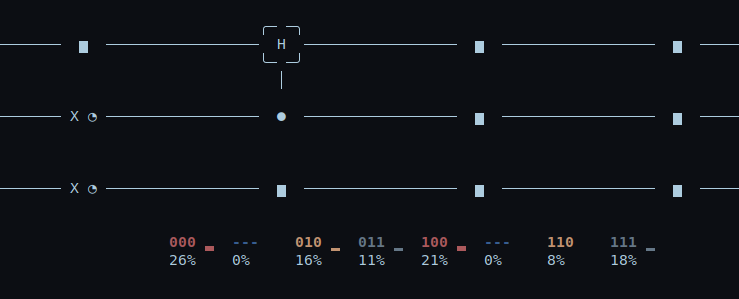

# Qtap

From the [Qpong](https://github.com/HuangJunye/QPong) quantum codebase. 

Compose your quantum circuit to match the track's symbols.

## Preview
### Menu


### 2 qbits


### 3 qbits


### Explore the composition with the Circuit Design mode


#### A few examples




## Compatibility

This game has been designed on and for Linux. Although it works on windows, a few bugs are known, such as losing inputs, color disappearing and missing music.

Unicode is needed to play correctly : we recommend using [wlstty](https://github.com/mintty/wsltty) on Windows.

## Install

```bash
make install
```

## Run
```bash
./venv/bin/python3 main.py 
```

or

```bash
make run
```
